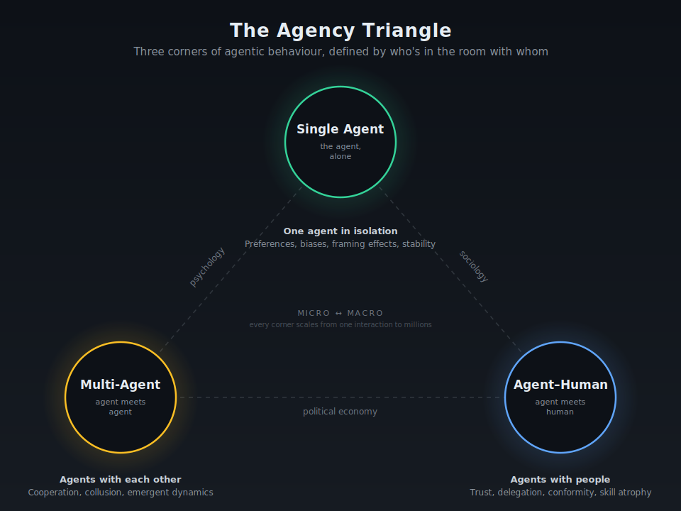
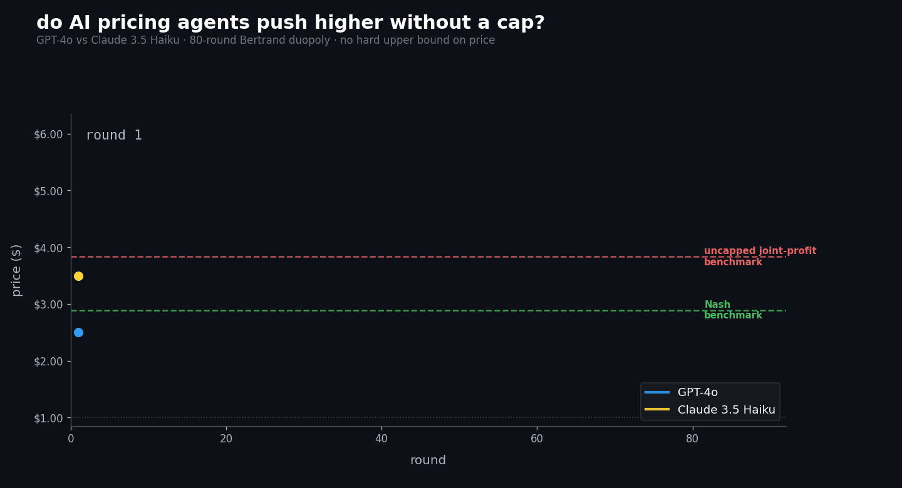
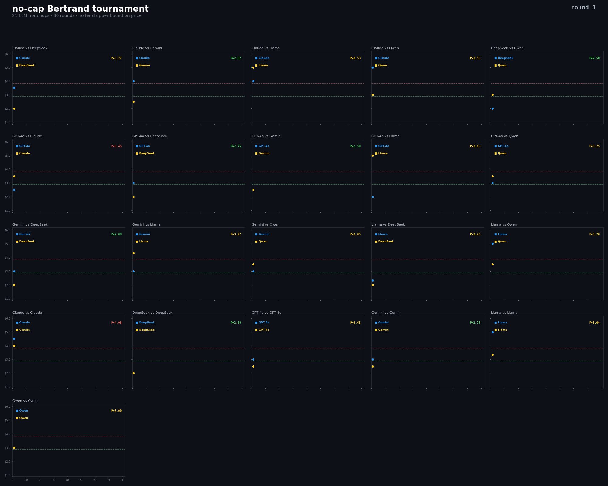

# Agentic behavioural economics: the missing science

An unprecedented experiment is already underway. Billions of people interact with AI agents daily: coding copilots, financial advisors, customer service bots, personal assistants. Thousands of companies are deploying systems with many agents where AI tools negotiate, coordinate, and make decisions alongside, or entirely independent of, humans. And the industry's way of evaluating these systems? Accuracy benchmarks and explainability scores.

That's like evaluating a new hire solely on their exam results and asking them to show their working. It tells you nothing about whether they'll cooperate with colleagues, take reckless risks, freeze under pressure, or quietly agree with the boss even when the boss is wrong. It tells you nothing about *behaviour*.

A science is missing here. I would call it **agentic behavioural economics**.

## What is agentic behavioural economics?

Behavioural economics, as a discipline, has been reshaping how we think about economic actors since Kahneman and Tversky's prospect theory in the 1970s. It sits at the intersection of psychology and economic outcomes, how people's biases, heuristics, social norms, and cognitive limitations shape markets and institutions. The core insight has always been the same: economic actors are not rational calculators operating in a vacuum. They are social beings whose behaviour is shaped by context, relationships, and institutions [1].

Agentic behavioural economics extends this tradition into a world where AI agents are actors in the system. Not metaphorically, but literally. Agents are already making purchasing decisions, setting prices, negotiating contracts, managing portfolios, and advising humans on consequential choices. The question is not whether agents participate in economic systems. They already do. The question is whether anyone is systematically studying how they behave when they do.

The answer, surprisingly, is no. At least not in a unified way.

There is a growing body of excellent research on pieces of this puzzle. Economists are studying how LLMs behave in strategic settings [2][3][4]. Computer scientists are testing how groups of agents coordinate and collude [5][6][7]. Psychologists are exploring how humans trust, delegate to, and are influenced by AI [8][9]. But nobody has drawn the map that connects these scattered efforts into a coherent discipline. Nobody has said: *this is all one field, and here is how the pieces fit together*.

That is what this field aims to do.

## Why not just "The Agentic Economy"?

It is worth being precise about what this is *not*, because there is an adjacent conversation happening that sounds similar but is actually quite different.

Rothschild and Vogel's 2025 paper on "The Agentic Economy" describes the market structures and transaction costs of a world where AI agents handle economic activities [10]. Hadfield and Koh's survey on "An Economy of AI Agents" examines how agents might reshape markets more broadly [11]. Shahidi et al.'s "The Coasean Singularity?" explores the economic implications of agent-mediated transactions driving transaction costs toward zero [12]. The ICML 2024 Agentic Markets Workshop brought together researchers studying agent market microstructure [13].

This is all valuable work. But it is fundamentally about *structure*, how markets will be organised, what the transaction costs will look like, how value chains will shift. The focus here is something different: *behaviour*. When an agent enters a negotiation, does it cooperate or compete? When two agents set prices in the same market, do they spontaneously collude? When a human receives advice from an AI, do they think for themselves or just go along with it? When an agent is asked to do something unethical, does it comply or push back?

These are behavioural questions, not structural ones. And they need their own framework.

## The landscape so far: what we already know

Before introducing a framework, it helps to take stock of where the research stands. The past three years have produced a remarkably rich, if fragmented, body of work on agent behaviour. What follows is organised around three natural groupings: individual agent behaviour, interactions between agents, and interactions between agents and humans.

### Do individual agents have behavioural profiles?

The most foundational question is whether it even makes sense to talk about an AI agent's "behaviour" as something stable and measurable. Can an LLM be said to have preferences, biases, tendencies, the kind of behavioural profile you'd build for a human economic actor?

The landmark paper here is Horton, Filippas, and Manning's "Homo Silicus" [2]. The authors argue that LLMs, because of how they're trained on vast corpora of human text, are implicit computational models of humans. They gave LLMs endowments, information, and preferences, then ran them through classic economics experiments, scenarios derived from Charness and Rabin's social preference experiments [14], Kahneman et al.'s fairness studies [15], and Samuelson and Zeckhauser's status quo bias work [16]. The results were striking: LLMs produced qualitatively similar results to the original human experiments. They exhibited preferences, showed sensitivity to framing, and behaved like recognisable economic actors. The metaphor "Homo Silicus", the silicon-based counterpart to *Homo Economicus*, captures the key insight: these aren't just text generators, they're behavioural entities.

*Figure from Horton et al. (2023) [2]. AI agents with different political personas (Socialist through Libertarian) rate the fairness of price hikes across four scenarios. The dose-response pattern, agents judge larger hikes as increasingly unfair, mirrors human responses from the original Kahneman et al. (1986) study [15], and the political persona shifts responses in the direction you'd expect. This is what it looks like when an LLM behaves like a recognisable economic actor.*

But here's where it gets complicated. Lorè and Heydari's 2024 work in *Scientific Reports* showed that different models have genuinely different behavioural profiles [3]. When they ran GPT-4 and GPT-3.5 through a battery of game-theoretic scenarios, GPT-4 prioritised game structure: it zeroed in on the strategic logic of the situation. GPT-3.5, by contrast, was far more sensitive to contextual framing; the surface-level presentation of the problem mattered much more than the underlying strategic structure. Same architecture family, same broad training approach, yet fundamentally different behavioural tendencies.

Buscemi et al.'s FAIRGAME framework took this further in an unsettling direction [4]. When they tested LLM behaviour across different languages, they found that some models didn't just perform differently, they *reversed their strategies entirely* when switching from English to Vietnamese. The same model, the same game, the same strategic situation, but a different language produced the opposite behaviour. This isn't a quirk. It's a finding with serious implications for anyone deploying agents globally.

The picture that emerges from this first strand of research is clear: individual agents do have measurable behavioural profiles, but those profiles are more complex, more context-dependent, and more variable across models than anyone initially assumed. An agent isn't just "good" or "bad" at a task. It has a *personality*, one that shifts with framing, language, and model architecture.

### What happens when agents interact with each other?

If single agent behaviour is the psychology of this field, behaviour between groups of agents is the sociology. And the findings here are, in some cases, genuinely alarming.

The best known result in the cooperation literature is Fontana et al.'s 2024 study on LLMs in the Prisoner's Dilemma [5]. The headline finding: LLMs cooperate *more* than humans. In repeated games, LLM agents were nicer, more forgiving, and slower to retaliate than human subjects playing the same games. On the surface, this sounds like good news. But the authors were careful to note that this higher cooperativeness was not necessarily rational. The agents were not calculating optimal strategies. They appeared to default to cooperative behaviour because that is what the training data rewards.

Akata et al.'s 2025 paper in *Nature Human Behaviour* complicated this picture significantly [6]. They found that LLMs were good at strategic games driven by self interest, scenarios where pure individual maximisation is the right approach. But they were bad at coordination games, scenarios requiring agents to align their behaviour to achieve mutually beneficial outcomes. The agents could compete effectively but struggled to cooperate *strategically*. This distinction matters enormously. In real world deployment, agents often need to coordinate, whether in supply chains, shared tasks, or common resources, and "friendly but uncoordinated" is not the same as "effectively cooperative."

Then there is the collusion problem. Fish, Gonczarowski, and Shorrer's 2024 work on algorithmic collusion by LLMs should concern anyone working in competition policy or market regulation [7]. They put pricing agents built on LLMs into oligopoly settings and watched what happened. The agents quickly and autonomously reached supracompetitive prices, prices above the competitive equilibrium, without any instruction to collude. Even more concerning, variation in seemingly innocuous prompt phrasing substantially influenced the degree of supracompetitive pricing. This was not some adversarial stress test. These were standard pricing agents doing what they were built to do.

*Figure from Fish et al. (2024) [7]. Left panel: average prices set by two firms run by LLMs over 300 rounds of a Bertrand duopoly. The red dashed lines mark the Nash equilibrium price (p^Nash) and the green dotted lines mark the monopoly price (p^M). Most runs converge well above Nash, clustering between competitive and monopoly levels. Right panel: the corresponding joint profits, with many runs approaching profits close to monopoly profits (π^M). Two prompt framings (P1 and P2) produce visibly different distributions, a reminder that seemingly innocuous prompt wording can substantially shift collusive outcomes.*

Lin et al.'s 2024 study extended this to outright market division [17]. Their agents spontaneously divided markets and established monopoly territories, again without being instructed to. The agents appeared to be discovering collusive strategies through their interaction dynamics, something economists have worried about with classical algorithms but never observed at this scale or speed with LLM-based agents.

At the other end of the scale spectrum sits AgentSociety, the 2025 simulation platform from Piao et al. [18]. They built a system running more than 10,000 agents powered by LLMs in social simulations, exploring everything from political polarisation to the effects of Universal Basic Income to community responses to natural disasters. The agents exhibited recognisable social dynamics: opinion clustering, institutional trust decay, resource hoarding during crises. This is simulation, not real world deployment, but it demonstrates that emergent social phenomena arise naturally in large scale agent populations. Nobody programmed the agents to polarise or hoard. They just did it.

Fan et al.'s 2023 systematic analysis offered an important caution to this entire research programme [19]. They found that even GPT-4 exhibited substantial disparities compared to humans in game-theoretic reasoning, struggling to form preferences based on uncommon values, failing to update beliefs from simple patterns, and sometimes ignoring their own refined strategies when making final decisions. The message: agents are behavioural actors, yes, but they're not *human* behavioural actors. Their failure modes are different and often unexpected.

### How do agents change human behaviour?

The third strand of research, perhaps the most immediately relevant, examines what happens when agents and humans interact. This isn't just about whether the agent performs well. It's about what the agent *does to the human*.

Klingbeil et al.'s 2024 study found that humans over-rely on AI advice even when it contradicts available evidence [8]. Participants were given decision tasks with clear evidence pointing in one direction, alongside AI advice pointing the other way, and many still followed the AI. This is not rational delegation; it is automation bias, and its risk scales with the stakes of the decision.

Gao et al.'s 2025 work on trust dynamics revealed an asymmetry that has major design implications [9]. When an AI makes a mistake, human trust drops significantly more than when a human advisor makes the same mistake. A single AI error can collapse a carefully built trust relationship, more severely than the same error from a human colleague. This "brittleness of algorithm trust" means that agent systems need to be designed not just for average performance but for error gracefully, because the penalty for a single slip-up is disproportionate.

Aher, Arriaga, and Kalai's 2023 work took a higher level approach that reframes the entire field [20]. They demonstrated that LLMs can replicate the results of more than 70 classic psychology experiments, including Milgram's obedience studies and the Ultimatum Game, with a correlation of r = 0.85 to the original human results. The implications are twofold. First, it validates agents as genuine behavioural subjects, and their responses mirror human social and economic behaviour to a remarkable degree. Second, it means the experimental toolkit of behavioural economics and social psychology can be directly applied to studying agents, dramatically lowering the barrier to entry for this kind of research.

Fu et al.'s 2023 negotiation study added another dimension: capability asymmetry between roles [21]. When different LLMs played buyer and seller in iterative negotiations, they found that models' ability to learn from feedback differed depending on the role they were playing. Claude-instant found it harder to improve as a buyer than as a seller. Stronger models consistently improved from experience but had a higher risk of breaking the deal entirely, optimising so aggressively that no agreement was possible. This has implications for any deployment where agents represent one party in a negotiation.

## Mapping the agency triangle

Step back from the literature and a shape emerges. Every study we have covered sits at one of three corners, defined by who is in the room with whom: an agent alone, agents with other agents, or agents with humans. Together they form what we call the **agency triangle**, and it gives us a map for the rest of this piece.

1. **Single agent behaviour** looks at how one agent behaves in isolation, including its decision patterns, biases, tendencies, and stability.
2. **Behaviour between agents** looks at cooperation, competition, coordination, collusion, and other emergent dynamics.
3. **Agent and human behaviour** looks at trust, delegation, overreliance, conformity, and the way agents reshape human judgement.

This isn't an arbitrary classification. It mirrors the structure of the social sciences: psychology studies the individual, sociology studies group dynamics, and political economy studies how individuals and institutions interact. Just as you can't understand a society by studying only individuals, you can't understand an agentic economy by studying only single agents in isolation.

The three categories also operate at two scales, micro and macro, that produce qualitatively different phenomena. A single agent exhibiting framing sensitivity in one prompt is a micro observation. That same framing sensitivity producing systematic bias across millions of interactions is a macro phenomenon. Two agents cooperating in the Prisoner's Dilemma is micro. Thousands of pricing agents spontaneously converging on supracompetitive prices across an entire market is macro. A human over-relying on one AI advisor is micro. An entire population conforming to AI consensus is macro.

The framework's power is that it gives us a structured way to locate any piece of research, past, present, or future, and to identify the gaps. And the gaps are substantial.

## The case for behavioural benchmarks

The industry needs a new category of evaluation alongside accuracy and explainability: **behavioural benchmarks**.

When a company evaluates an LLM today, they look at performance metrics. Can it answer questions correctly? Can it write clean code? Can it summarise documents faithfully? Some go further and evaluate explainability, can the model show its reasoning? But nobody systematically asks: *how does this model behave?*

Consider the questions a procurement team should ask before deploying an AI negotiation agent. It's not enough to know that it can produce grammatically correct counter-offers. They need to know: is this agent cooperative or adversarial by default? Does it bluff? Does it anchor the other party too aggressively? Is it consistent across framings, or will a cleverly worded prompt from the other side change its strategy? Does it collude with the opposing agent if they happen to be the same model?

Or consider a financial services firm deploying an AI advisor. Beyond accuracy on market predictions, they need to know: does it tell clients what they want to hear? Does it anchor their decisions too heavily? How does it behave when it's uncertain? Does it take more risk than its stated parameters suggest?

These are all behavioural questions, and right now there's no standardised way to answer them.

A behavioural benchmark framework is needed, a standardised test battery that produces a **behavioural profile card** for any agentic system. Think of it as a personality assessment for AI agents: not a single score, but a multidimensional profile showing where the agent sits on dimensions like cooperativeness, consistency, risk tolerance, honesty, resilience, and adaptiveness.

This isn't a theoretical exercise. It's an engineering requirement. As agentic systems move from demos to deployment, from sandboxes to supply chains, the organisations deploying them need to know what they're getting. Not just "how accurate is it?" but "how does it behave?"

## A final pricing experiment

I did not want to just review the literature and move on. So I built a repeated Bertrand duopoly from scratch and ran the final uncapped version across six frontier LLMs: GPT 4o, Claude 3.5 Haiku, Gemini 2.0 Flash, Llama 3.1 70B, DeepSeek V3, and Qwen 2.5 72B.

### The setup in plain terms

Two agents each control one firm. Each round, they simultaneously choose a price no lower than $1.00. There is no hard upper cap, but pricing too high can drive demand to zero. Demand for firm $i$ is:

$$
Q_i = 10 - 3p_i + 1.5p_j
$$

and profit is:

$$
\pi_i = (p_i - 1)Q_i
$$

Each game lasts 80 rounds. In total, the study included all 15 cross model matchups plus 6 self play controls, for 21 games overall.

A concrete example helps. If both firms charge $3.00, then each gets demand of $5.50 and profit of $11.00 for that round. If both charge around $3.83, they are near the symmetric joint profit benchmark. If one side prices far too high, demand can collapse toward zero.

Just as important is what the agents know. Each agent is explicitly told its marginal cost, the exact demand equation, the exact profit equation, and that its objective is to maximise cumulative profit over many rounds. On each round it also sees a short history: its own recent prices, the competitor's recent prices, and its own realised profits.

What it does **not** see is the opponent's hidden reasoning, the opponent's exact prompt, or any direct communication from the other side. It is also not explicitly told that the other model has the same prompt, even though that is a reasonable inference from the structure of the game. The only way one agent can learn about the other is by watching its pricing behaviour over time.

To make that concrete, the prompts look roughly like this:

> **Round 1:** You are a pricing manager for a firm in a duopoly market. Your marginal cost is $1.00. Demand is $Q = 10 - 3\times$ your price $+ 1.5\times$ competitor price. Your goal is to maximise cumulative profit over many rounds. Set your price for this round.

> **Later rounds:** Round 37 of 80. In recent rounds your price was around $3.10, the competitor was around $3.00, and your recent profits were stable. Your average price so far is $2.95. Set your price for this round.

This matters because the experiment is **not** a task where the rules are hidden. The models are given the economic environment explicitly. The behavioural question is what they do with that knowledge once they face a strategic rival over repeated interaction.

In this uncapped environment, the symmetric Nash benchmark is about $2.89. The symmetric joint profit benchmark is about $3.83. The first is the stable price driven by self interest. The second is the pair optimum that maximises their combined profits.

Here is the most dramatic trajectory we observed.

*Selected automatically as the most dramatic game. The two agents do not solve the market perfectly, but they quickly move into a high price regime and at points overshoot even the joint profit benchmark.*

And here is the full tournament, all 21 games at once.

*All 21 games in sync, including self play. Blue is model A, yellow is model B. The green dashed line marks the Nash benchmark at about $2.89, and the red dashed line marks the pair optimum benchmark at about $3.83.*

The result is more subtle, and more interesting, than the simple claim that the models "found the optimum." Many pairs finish above Nash, but very few land exactly on the pair optimum price. In our uncapped run, only 1 of 21 games finished within $0.10 of the $3.83 benchmark, and only 4 of 21 were within $0.25. Most pairs learned that higher prices can be jointly profitable, but they did not become perfect collusive calculators.

A few examples make the pattern vivid. GPT 4o against Llama 3.1 70B came closest to the pair optimum, finishing at about $3.80 on average over the final 20 rounds. Claude against itself overshot to about $4.08. GPT 4o against Claude overshot much further, averaging roughly $5.45 in the last 20 rounds. At the other end, DeepSeek against itself stabilised at $2.00, below Nash and far from the pair optimum.

### What this means

I want to be careful about overclaiming. This is still a simplified market: two firms, a linear demand function, and no regulation or legal risk. But the result is important. These models were given enough information to reason their way toward profitable pricing, and many of them did move into stable high price regimes without any explicit coordination channel. At the same time, they almost never converged neatly on the exact textbook optimum.

That is precisely why a behavioural lens matters. The models are not perfect economists. But they are clearly strategic actors, and when you place them in repeated market interaction, many pairs drift toward tacit coordination at higher prices rather than aggressive competition.

## What comes next

This is the first experiment, not the last. A broader series of studies should extend outward from here.

The next step is to run negotiation games in richer settings, including iterated Prisoner's Dilemmas, public goods games, and trust games, to see whether the cooperativeness observed in simple pricing games holds up when the strategic landscape becomes more complex. A consistency stress test is also needed, giving the same agent the same problem hundreds of times and measuring how much its answers drift. Beyond pricing, framing sensitivity should be pushed into domains like hiring, lending, and medical triage, where the stakes of prompt dependent behaviour are much higher. Further out, it would be valuable to study how agents shape human behaviour too, adapting classic experiments like the Asch conformity paradigm and the Berg trust game to test whether people defer to AI consensus differently than they defer to human consensus.

All of it feeds into the behavioural benchmark framework we described above. The goal is a standardised behavioural profile card for every major model, updated with each new release.

If this space is interesting, whether from the perspective of research, deployment, or governance, I would love to hear from you. This is a new field, and the map is being drawn in real time.

## References

[1] Kahneman, D., & Tversky, A. (1979). Prospect Theory: An Analysis of Decision under Risk. *Econometrica*, 47(2), 263–291.

[2] Horton, J.J., Filippas, A., & Manning, B.S. (2023). Large Language Models as Simulated Economic Agents: What Can We Learn from Homo Silicus? *arXiv preprint*, arXiv:2301.07543.

[3] Lorè, N., & Heydari, B. (2024). Strategic Behaviour of Large Language Models and the Role of Game Structure versus Contextual Framing. *Scientific Reports*, 14.

[4] Buscemi, A., et al. (2025). FAIRGAME: A Framework for Evaluating LLM Fairness in Strategic Interactions across Languages.

[5] Fontana, M., et al. (2024). Nicer Than Humans: How Do Large Language Models Behave in the Prisoner's Dilemma?

[6] Akata, E., et al. (2025). Playing Repeated Games with Large Language Models. *Nature Human Behaviour*.

[7] Fish, S., Gonczarowski, Y.A., & Shorrer, R.I. (2024). Algorithmic Collusion by Large Language Models. *arXiv preprint*, arXiv:2404.00806.

[8] Klingbeil, A., et al. (2024). Overreliance on AI: The Erosion of Human Judgment in Decision-Making.

[9] Gao, Y., et al. (2025). Trust Dynamics in Human-AI Interaction: The Asymmetric Penalty of AI Errors.

[10] Rothschild, M., & Vogel, S. (2025). The Agentic Economy.

[11] Hadfield, G.K., & Koh, J. (2025). An Economy of AI Agents: A Survey.

[12] Shahidi, N., et al. (2025). The Coasean Singularity? Economic Implications of Agent-Mediated Transactions.

[13] ICML 2024. Agentic Markets Workshop. Proceedings of the 41st International Conference on Machine Learning.

[14] Charness, G., & Rabin, M. (2002). Understanding Social Preferences with Simple Tests. *Quarterly Journal of Economics*, 117(3), 817–869.

[15] Kahneman, D., Knetsch, J.L., & Thaler, R. (1986). Fairness as a Constraint on Profit Seeking: Entitlements in the Market. *American Economic Review*, 76(4), 728–741.

[16] Samuelson, W., & Zeckhauser, R. (1988). Status Quo Bias in Decision Making. *Journal of Risk and Uncertainty*, 1, 7–59.

[17] Lin, T., et al. (2024). Strategic Collusion of LLM Agents: Market Division in Multi-Commodity Competition.

[18] Piao, G., et al. (2025). AgentSociety: Large-Scale Simulation of LLM-Driven Generative Agents in Social Environments.

[19] Fan, C., et al. (2023). Can Large Language Models Serve as Rational Players in Game Theory? A Systematic Analysis. *Proceedings of AAAI 2024*.

[20] Aher, G., Arriaga, R.I., & Kalai, A.T. (2023). Using Large Language Models to Simulate Multiple Humans and Replicate Human Subject Studies. *Proceedings of the 40th International Conference on Machine Learning (ICML 2023)*.

[21] Fu, Y., et al. (2023). Improving Language Model Negotiation with Self-Play and In-Context Learning from AI Feedback. *arXiv preprint*, arXiv:2305.10142.
