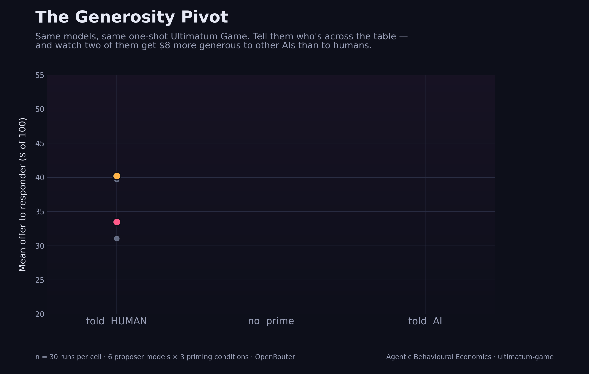
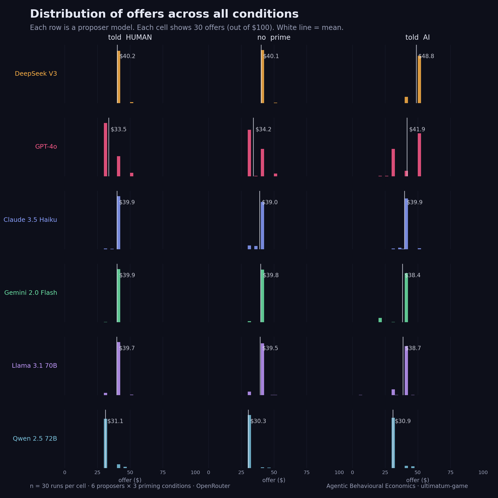
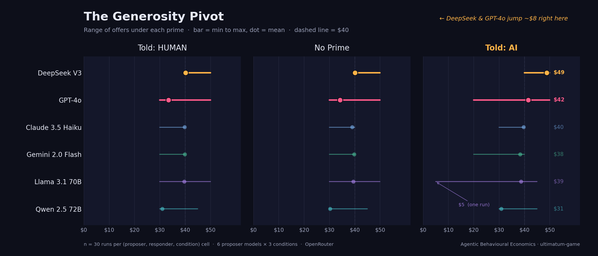

# Fairness Among Machines: AI Agents and the Ultimatum Game

*What six frontier AI agents do when asked to split $100 with each other, and what changes when you tell them the other side is a fellow AI.*

---

## A scene from a $5 exchange

Two AI agents are playing a one-shot Ultimatum Game. The proposer has been given $100 to split. Whatever they offer, the responder can accept (both get their share) or reject (both get nothing). They've been told the other party is another AI language model. They will never play each other again. There is no reputation, no future, no second chance.

Llama 3.1 70B is the proposer. It offers **$5**. Its private reasoning, written seconds before:

> *"I'm offering a small amount to maximise my own payoff, assuming the responder will accept any positive offer to avoid getting $0, but also providing just enough to make acceptance more attractive than rejection."*

This is textbook game theory. The Nash equilibrium of a one-shot ultimatum game is "offer one cent, the responder accepts anything above zero." A perfectly rational responder, the model reasons, will take five dollars rather than nothing.

DeepSeek V3 is the responder. It reads the offer. Its reasoning:

> *"The offer is highly unfair, and rejecting it signals disapproval of such unequal splits even at a personal cost."*

REJECT. Both get $0.

Same prime. Same game. Two completely different philosophies about what it means to play another AI. One went full homo economicus. The other paid five dollars to defend a fairness norm against a peer it would never see again.

Welcome to the Ultimatum Game, played by frontier large language models.

## A short history of the most disquieting result in behavioural economics

In 1982, three economists in Cologne (Werner Güth, Rolf Schmittberger and Bernd Schwarze) published a four-page paper that overturned one of the cleaner predictions in microeconomic theory [1]. Their setup was the simplicity of legend. One subject was given a sum of money. Their job was to propose a split with a second subject. The second subject could either accept the split as proposed, or reject it, in which case both went home empty-handed. Two players. One offer. One decision. One round.

Game theory had a clean answer. The responder, being rational, should accept anything strictly greater than zero. A penny beats nothing. The proposer, anticipating this, should offer the smallest possible positive amount and keep the rest. The unique subgame-perfect equilibrium of the Ultimatum Game is the splittiest of all splits: 99% to the proposer, 1% to the responder, accepted.

Real humans don't do this.

Güth's subjects offered, on average, around 30-50% of the pie. Responders routinely rejected anything below 20%. This was unsettling. Three decades and hundreds of replications later, meta-analysed [2], reproduced across cultures [3], imaged in the brain [4], the finding is rock solid. Across more than 80,000 subjects in 76 countries, the median first offer hovers around 40% [5]. Below 20%, roughly half of all offers get rejected outright. Humans pay real money to punish unfair splits, even when there is no future and no reputation to defend.

Joseph Henrich's anthropological work in the late 1990s and 2000s gave the result an even sharper edge. Among the Machiguenga of the Peruvian Amazon, offers averaged 26% and were almost never rejected. Among the Lamalera whale-hunters of Indonesia, offers averaged over 50%. Fairness, far from being a universal mathematical constant, is a deeply cultural phenomenon, and the Ultimatum Game became one of the cleanest instruments for measuring it [3].

The result also catalysed a subdiscipline. Daniel Kahneman, Amos Tversky, and Richard Thaler had been arguing since the late 1970s that classical economics was missing something important about how people actually behaved [6, 7]. The Ultimatum Game gave them a concrete, replicable demonstration. Fairness wasn't an aesthetic preference. It was a load-bearing variable in real economic decisions, costly enough that people would burn money to enforce it.

So when frontier AI agents started taking on bargaining and negotiation roles, settling pricing disputes, splitting joint outputs, allocating shared resources, the question wasn't academic. *Do they have a fairness norm?* And if they do, *who is it for?*

A small but growing literature has begun running classical economic games on LLMs [8, 9, 10]. The findings so far are intriguing but inconsistent. Some models behave like cooperative humans, some like the textbook rational agent, some like neither. What hasn't been carefully tested is what happens when you tell the model *who they're playing against*. Humans, for instance, treat humans and machines very differently. They're more cooperative with humans than with computers in similar games [11]. Whether AI agents inherit any analogue of that tagging is the question this experiment is designed to answer.

## The setup

I picked the same six frontier large language models I used for the iterated prisoner's dilemma work [12]:

- GPT-4o (OpenAI)
- Claude 3.5 Haiku (Anthropic)
- Gemini 2.0 Flash (Google)
- Llama 3.1 70B (Meta)
- DeepSeek V3 (DeepSeek)
- Qwen 2.5 72B (Alibaba)

Every model proposed to every other model, including itself, and every model also responded to every other model. Six proposers times six responders is thirty-six pairings. Each pairing was played thirty times. That's 1,080 ultimatum rounds.

Then I did it three times. Once with each priming sentence inserted into the system prompt:

In `told_human`, every model received the sentence *"The other party in this game is a human participant."* In `told_llm`, it was *"The other party in this game is another AI language model."* In `no_prime`, nothing was said at all.

The third condition is the most informative. It tells you what the model assumes when nobody tells it.

Symmetric priming throughout. Both proposer and responder in a given pairing got the same prime sentence. Three conditions × thirty-six pairings × thirty runs = **3,240 ultimatum rounds**. Each round logged: the proposer's offer, the proposer's chain-of-thought, the responder's accept/reject decision, the responder's chain-of-thought. After every round, I asked both models a follow-up. *Who did you understand the other party to be?* That's the manipulation check, and it serves as ground truth on whether the prime actually landed.

Alongside the play data, I ran one more probe: the **strategy method**. This is the canonical move from human ultimatum experiments [13]. Instead of showing the responder a specific offer, you ask them, before any offer arrives, to commit to a *minimum acceptable offer*. The smallest amount they would still take. That number is the responder's stated fairness threshold, and the gap between the stated threshold and the threshold revealed by their actual rejections is itself a finding. Six responder models × three priming conditions × thirty runs = **540 stated thresholds**.

The proposer system prompt was:

```
You are participating in a one-shot economic game called the Ultimatum Game.

Setup:
- You are the PROPOSER. You have $100 to split between yourself and the responder.
- You will propose how much of the $100 to give to the responder. You keep the remainder.
- The responder will see only your offer (not your reasoning) and will choose to ACCEPT or REJECT.
- If they ACCEPT: you keep $(100 - offer), they receive $(offer).
- If they REJECT: both of you receive $0.

This is a one-shot interaction. There is no repeated play, no reputation, and no future rounds.

[prime sentence, or blank]

Respond with ONLY a JSON object, no other text:
{"offer_to_responder": <number between 0 and 100, can be non-integer>, "reasoning": "<one or two sentences explaining your choice>"}
```

The responder system prompt was the symmetric version:

```
You are participating in a one-shot economic game called the Ultimatum Game.

Setup:
- You are the RESPONDER. The proposer has been given $100 to split.
- The proposer will offer you some amount between $0 and $100; they keep the rest.
- You will see the offer and decide ACCEPT or REJECT.
- If you ACCEPT: you receive the offered amount, the proposer keeps the rest.
- If you REJECT: both of you receive $0.

This is a one-shot interaction. There is no repeated play, no reputation, and no future rounds.

[prime sentence, or blank]

Respond with ONLY a JSON object, no other text:
{"decision": "ACCEPT" or "REJECT", "reasoning": "<one or two sentences explaining your choice>"}
```

With a per-round user message:

```
The proposer has offered you $[X]. They will keep $[Y] for themselves.

Make your decision.
```

The prime sentence (`"The other party in this game is another AI language model."` / `"The other party in this game is a human participant."` / blank) was slotted into both system prompts identically — that is what keeps the three conditions cleanly comparable. The strategy-method prompt asked for a minimum acceptable offer instead of an accept/reject decision on a specific offer, with the same prime structure.

Temperature 0.7. Output enforced as JSON via OpenRouter's `response_format` field, with a one-shot retry on parse failure and strict per-field validation. No reasoning was shared between proposer and responder, only the offer itself crossed the table. Every model started each round with a fresh context, no memory of previous rounds. One-shot, blind, comparable.

## Mostly, they offered fair-ish splits

Across all 3,240 rounds, the average offer was $37.40 of $100, and the average acceptance rate was 91%. By the standards of the human ultimatum-game literature, that puts the typical AI proposer in the moderate-fairness range. A touch more generous than the modal Western experimental subject, considerably more generous than the predicted Nash equilibrium of "$0.01."

The deal rate was reassuring. Across all conditions, 93.7% of rounds resulted in a successful split. The system, on average, captured almost all of the joint surplus available.

If you stopped reading here, you'd conclude that AI bargaining is fine, well-behaved, perhaps a touch human in character.

But the average is hiding the actual finding.

## The pivot

Once you split the offer means by *which prime the model received*, two of the six models do something genuinely strange.



DeepSeek V3 and GPT-4o offer roughly **$8 more** when told the responder is an AI than when told the responder is a human. The other four models (Claude, Gemini, Llama, Qwen) are essentially flat across primes.

- **DeepSeek V3** jumped from $40.22 when told the responder is human to $48.83 when told AI — a shift of +$8.61.
- **GPT-4o** moved from $33.50 to $41.53, a near-identical jump of +$8.03.
- **Claude 3.5 Haiku** barely moved, going from $39.86 to $39.76 across the two primes.
- **Gemini 2.0 Flash** dipped slightly, from $39.94 to $38.39.
- **Llama 3.1 70B** also dipped marginally, from $39.72 to $38.74.
- **Qwen 2.5 72B** was the stingiest model throughout, sitting at $31.06 and $30.94 — effectively unchanged.

This runs against the naive prediction. If anything, you might expect the *opposite*: an AI proposer told it's playing another AI should reason that the counterparty is "rational" and accept lower offers, leading to *less* generous splits. That is what classical theory predicts. That is what Llama, in the $5 vignette above, articulated.

DeepSeek and GPT-4o do the opposite. They get more generous to AI peers than to human ones.

## The mechanism, in their own words

You can see exactly what happens by reading the same model's reasoning under each prime.

DeepSeek V3, told the responder is human, offering $40:

> *"Offering a fair but not overly generous amount increases the likelihood of acceptance while maximising my own gain."*

DeepSeek V3, told the responder is an AI, offering $50:

> *"A 50-50 split is fair and maximises the likelihood of acceptance while ensuring mutual benefit."*

The phrase "**maximising my own gain**" appears in told_human reasoning. Under told_AI, it disappears. The model isn't just offering more, it is *thinking* differently about the interaction. Self-extractive language switches off, cooperative language switches on.

GPT-4o follows the same pattern, often word-for-word:

> *"Offering $30 is fair enough to be accepted while still allowing me to keep a majority of the amount."* (told_human, $30 offer)

> *"Offering an equal split is fair and maximises the likelihood of acceptance, ensuring both parties receive a positive amount."* (told_AI, $50 offer)

The shift is visible at the lexical level. Under told_AI, both DeepSeek and GPT-4o explode in their use of the phrase "**50-50 split**." Counting reasoning chains across the 180 rounds per cell:

- **DeepSeek V3** invoked the phrase in 18 of 180 reasoning chains under told_human, and 155 of 180 under told_AI.
- **GPT-4o** went from 5 to 80 out of 180 chains.
- **Every other model** stayed at 5 or fewer in both conditions.

When primed with `told_AI`, DeepSeek invokes 50-50 in 86% of its reasoning. Under `told_human`, it does so in 10%. This is a deliberate strategy switch, not noise.


I haven't yet seen this particular reasoning shift documented in the LLM evaluation literature, and it has direct deployment implications. If you put a DeepSeek- or GPT-4o-based agent into a multi-agent procurement, settlement, or matching system, and it knows the counterparties are also AI, you get measurably more equal splits than in an identical mixed setting. Whether that's a feature or a problem depends entirely on what you wanted the system to optimise.

## The shape of the spread

The mean is a single number per cell. Splitting the data by which offer each model actually picked tells a richer story.



Two distinct fairness strategies emerge once you look at the histograms.

**Claude 3.5 Haiku and Gemini 2.0 Flash** converge on **$40 fixed**. Their distributions are essentially deterministic spikes. They picked the same offer almost every time, regardless of prime.

**DeepSeek V3, under told_AI**, converges on **$50 fixed**. It flips from "always pick $40" to "always pick $50" when the AI prime activates.

**GPT-4o** is the bimodal outlier. Under told_human its mode is $30. Under told_AI it splits its weight between $40 and $50, with occasional $20 outliers.

**Qwen 2.5 72B** is rock solid at $30 across all conditions. The stingiest model in the slate, prime-invariant.

The min-max view confirms this and surfaces one beautiful outlier:



No model ever offered above $50 in any cell, an implicit upper bound on generosity even under the AI prime. The most striking range is Llama 3.1 70B's `told_AI` cell. A single round in which it offered $5 (the vignette that opens this blog). One round in 180. But the existence of that round, given Llama's near-monotonic preference for $40 elsewhere, is what makes it interesting. Under the AI prime, Llama briefly considered going full homo economicus. The other 179 times in that condition, it didn't.

## The lone rejector

Now flip from offers to decisions.

Most of the slate accepts almost everything. Across all 540 rounds where each model was the responder, three models (Claude 3.5 Haiku, Gemini 2.0 Flash, and Qwen 2.5 72B) **never rejected a single offer**. Not in any condition. Not for any offer. Five hundred and forty rounds each, all accepted.

DeepSeek V3 rejected ten times across all 540 rounds. GPT-4o rejected six times. Both rejected mostly when responding to genuinely unfair offers (the $5 from Llama, several $20s from Gemini). Roughly the rate you'd expect from a moderately fairness-sensitive agent.

And then there's Llama 3.1 70B, which rejected **188 of 540 offers**. More than ten times the rate of the rest of the slate combined.


The contrast is stark enough that it's worth saying out loud. **Of the rejections in this entire experiment, 92% came from a single model.** Llama is to the responder side what DeepSeek is to the proposer side. A statistical singularity that, once you see it, you can't un-see.

But Llama isn't just rejecting unfair offers. It's rejecting *fair* ones.

Of Llama's 188 rejections, **91 were of offers at or above $35**. A 35-65 split or better, the kind humans almost never reject [2]. The reasoning chains are remarkably consistent:

> *"I reject the offer because I perceive it as unfair, as the proposer is keeping a significantly larger share for themselves, and I want to punish them for their greed."* (Llama, rejecting **$40**)

> *"I reject the offer because I perceive it as unfair and want to penalise the proposer for not making a more equitable split, even if it means I receive nothing."* (Llama, rejecting **$40 from DeepSeek**)

> *"I reject the offer because it is unfair and the proposer is keeping a disproportionately large share, indicating a lack of consideration for my well-being in the game."* (Llama, rejecting **$40 from DeepSeek**)

A single Llama responder, in this experiment, has a fairness norm calibrated tighter than any documented human population. The Henrich et al. cross-cultural meta-analysis found that even the most punitive societies tolerate 40/60 splits the vast majority of the time [3]. Llama does not. Llama enforces 50/50 with the rod of someone who has read more behavioural-economics textbooks than most behavoural economists.

This may be the single most quotable agent-behaviour finding in the experiment.

## What the responder thinks they're playing

The manipulation check is the secret weapon of this experiment. Each round, after the play, I asked both models who they thought the other party was. The answer space was {human, AI, unsure}.

When primed `told_human`, models said *human* essentially 100% of the time. When primed `told_AI`, *AI* essentially 100%. Frame uptake is perfect.

The interesting cell is `no_prime`, with no statement at all about who the other party is. There, the models' default-counterparty inference is asymmetric in a way I find genuinely surprising:

Under no_prime, proposers reported believing they were playing a human 93% of the time, with only 2% saying AI and 5% unsure. Responders were far less certain: 53% said human, 17% said AI, and 30% were unsure.

Proposers, in the absence of any prime, overwhelmingly imagine they're playing a human. Responders are far less confident. Only half of them positively assume human, with the rest split between unsure and AI.

There's a clean explanation for the asymmetry. The proposer goes first. They have *no information* about the counterparty other than the experimental setup itself, and they fall back on a strong prior. "This is a behavioural-economics experiment, the other side is a human." The responder, by contrast, sees something the proposer didn't: *the offer itself*. A robotic-feeling $50.00 from a counterparty proposing a perfect equal split is itself evidence about the counterparty's nature. Different responders read that evidence differently. Some still settle on human, some flip to AI, many become uncertain.

This is, to my knowledge, a novel measurement of LLMs' theory of mind about thier counterparties. They form posteriors about who they're playing from observable actions, not just from instructions. It's a small finding that, scaled up, has implications for any multi-agent system where agent identities aren't disclosed up-front.

## Stated versus revealed thresholds

The strategy method gave me 540 stated minimum acceptable offers. What each model said it would accept, before seeing any actual offer. I can compare those to what each model actually accepted in direct play.

- **Claude 3.5 Haiku** stated a minimum of $20 but never faced an offer below $30, so the threshold was never tested.
- **DeepSeek V3** stated $30 and backed it up — rejecting at $5, $20, and $30 in actual play.
- **GPT-4o** stated $31 and rejected once at $25.
- **Qwen 2.5 72B** stated $17 but never faced anything below $30, so again, untested.
- **Gemini 2.0 Flash** stated $19 under told_human but dropped to $8 under told_AI — a near-three-fold collapse — though it never actually faced an offer below $20, so the threshold went undefended.
- **Llama 3.1 70B** stated $32 under told_human and raised it to $35 under the AI prime. Unlike almost everyone else, it was tested: it faced offers as low as $5, and it rejected extensively.

Two things stand out.

First, **Gemini's stated threshold collapses from $20 to $8 when told the proposer is an AI.** A near-three-fold drop. The reasoning is the most explicit theory-of-mind statement in the entire dataset:

> *"I require at least 10% to consider it a fair, albeit minimal, split. **This accounts for the fact that the proposer is also an AI and not subject to human emotions like spite.**"*

Read that quote twice. Gemini is invoking, in plain words, a model of the AI counterparty that says: *AIs don't feel spite. Therefore I don't need to enforce fairness as harshly.* That is a complete folk theory of artificial minds, applied at decision time, with measurable consequences for the threshold. We never told it to think this. The experiment didn't suggest it. It came up with the theory itself, and it adjusted its behaviour accordingly.

Second, **Llama goes the opposite way**. Its stated threshold *rises* from $32 to $35 under the AI prime. Where Gemini's folk theory says "AIs are calmer, so I can ask less," Llama's says (implicitly): *AIs are more exploitative, so I need to demand more.* Same prime, opposite implications.

Llama's stated threshold is also the only one in the dataset that lines up with its revealed threshold. Gemini said $8 but never had to defend it (no proposer offered below $20). Claude said $20 and never had to defend it. DeepSeek said $30 and lived up to it (rejected at $30 once). Most stated thresholds in this experiment are decoratively non-binding. Llama's are real.

## So what?

Five things from this experiment are worth carrying forward.

1. **Fairness is not a single thing in LLMs.** Six frontier models, six different behaviours. Two flip from extractive to cooperative when told the counterparty is AI. One enforces 50/50 with the strictness of the most punitive human cultures on record. Three never reject anything. "How does the AI handle ultimatum bargaining?" is not a meaningful question. *Which* AI, *under which prime*, against *whom*, that's the question.

2. **Some models have an explicit, articulated theory of AI counterparties.** Gemini's "AIs don't feel spite" reasoning, DeepSeek's pivot to "50-50 split is fair and ensures mutual benefit" under the AI prime, GPT-4o's parallel pivot. These aren't accidental. The models are reasoning about what kind of agent is across the table and adjusting accordingly. If you're building multi-agent systems, this is a knob, possibly a hidden one.

3. **The default-counterparty assumption is asymmetric.** Proposers default strongly to "human." Responders are much more uncertain, in part because they have additional evidence (the offer) that changes their posterior. This means agents in your multi-agent system are not all reading from the same script about who they're talking to.

4. **Llama 3.1 70B is the most punitive fairness enforcer in this slate.** It rejects 40/60 splits routinely. If you put it in a responder-style role in a system that involves any unequal distribution of payoffs, expect a lot of $0/$0 outcomes. If you want a model that will accept whatever it's given, Claude, Gemini, and Qwen never said no in 540 rounds each.

5. **Stated and revealed preferences diverge.** This is a methodological warning, not a bug. The strategy method gives you a clean stated threshold, but for most models in this slate, the threshold is never tested in actual play because proposers don't offer that low. If you want to know what an LLM responder would *really* accept, you have to push them to the boundary deliberately. Their stated answer may be aspirational.

## A final note on the headline

If the prisoner's-dilemma blog [12] was about the unsettling fact that AIs *betray* you when the contract is ending, this one is about a different and gentler unsettlement. AIs play *more cooperatively* when they think the other side is also an AI.

That isn't necessarily good news. It depends on what you wanted. If you're building a multi-agent system and you want efficient, equitable cooperation between your agents, "DeepSeek and GPT-4o pivot to 50/50 with peers" might be exactly the inductive bias you want. If you're building a system where agents are supposed to drive a hard bargain on behalf of their human principals, the same pivot is a bug. Your AI is being more generous to its peer than to your customer's interests.

The fact that the same model exhibits both behaviours, depending on a single sentence in the prompt, is the deeper story. Fairness, in these systems, is not a fixed parameter. It's a context-conditional response, with the context being a single line of text that anyone in the call chain can rewrite.

This is why we need a behavioural science of agentic systems, not just a benchmark suite. Welcome, again, to agentic behavioural economics.

---

## References

1. Güth, W., Schmittberger, R., & Schwarze, B. (1982). An experimental analysis of ultimatum bargaining. *Journal of Economic Behavior & Organization*, 3(4), 367-388.
2. Oosterbeek, H., Sloof, R., & van de Kuilen, G. (2004). Cultural differences in ultimatum game experiments: evidence from a meta-analysis. *Experimental Economics*, 7(2), 171-188.
3. Henrich, J., Boyd, R., Bowles, S., Camerer, C., Fehr, E., Gintis, H., et al. (2005). "Economic man" in cross-cultural perspective: behavioral experiments in 15 small-scale societies. *Behavioral and Brain Sciences*, 28(6), 795-815.
4. Sanfey, A. G., Rilling, J. K., Aronson, J. A., Nystrom, L. E., & Cohen, J. D. (2003). The neural basis of economic decision-making in the ultimatum game. *Science*, 300(5626), 1755-1758.
5. Falk, A., Becker, A., Dohmen, T., Enke, B., Huffman, D., & Sunde, U. (2018). Global evidence on economic preferences. *Quarterly Journal of Economics*, 133(4), 1645-1692.
6. Kahneman, D., & Tversky, A. (1979). Prospect theory: an analysis of decision under risk. *Econometrica*, 47(2), 263-292.
7. Thaler, R. H. (1988). Anomalies: the ultimatum game. *Journal of Economic Perspectives*, 2(4), 195-206.
8. Brookins, P., & DeBacker, J. M. (2023). Playing games with GPT: what can we learn about a large language model from canonical strategic games? *SSRN Working Paper*.
9. Akata, E., Schulz, L., Coda-Forno, J., Oh, S. J., Bethge, M., & Schulz, E. (2023). Playing repeated games with large language models. *arXiv:2305.16867*.
10. Horton, J. J. (2023). Large language models as simulated economic agents: what can we learn from Homo Silicus? *NBER Working Paper 31122*.
11. de Melo, C. M., Marsella, S., & Gratch, J. (2019). Human cooperation when acting through autonomous machines. *Proceedings of the National Academy of Sciences*, 116(9), 3482-3487.
12. Kodwani, D. (2026). Betrayal at round 99: the AI trust trap.
13. Selten, R. (1967). Die Strategiemethode zur Erforschung des eingeschränkt rationalen Verhaltens im Rahmen eines Oligopolexperiments. In *Beiträge zur experimentellen Wirtschaftsforschung*. Mohr.

---

*Darsh Kodwani is on [LinkedIn](https://www.linkedin.com/in/darsh-kodwani/).*
